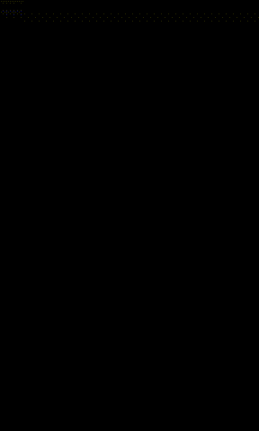

# MotionLayout Animations 🏃

This project was created to learn the basics of MotionLayout and how to use it to build rich animations in app.

Project created for the Udacity nanodegree Android Kotlin Developer program.

## Key Features ✨

- Defining an animation with ConstraintSets and MotionLayout
- Animating based on drag events
- Changing the animation with KeyPosition
- Changing attributes with KeyAttribute
- Running animations with code
- Animating collapsible headers with MotionLayout

## Project Milestones

This application uses MotionLayout to animate the:
- location
- size
- visibility
- alpha
- color
- elevation
- rotation
- and other attributes of multiple views at the same time.

## Overview

MotionLayout is a library that add rich motion into Android app. It's based upon ConstraintLayout and lets animate anything that can build using ConstraintLayout.

Using declarative XML application creates coordinated animations involving multiple views that are difficult to achieve in code.

MotionLayout animations extend many of the same concepts as Keyframe animations with Constraint Layout to allow to finely customize the animation.

